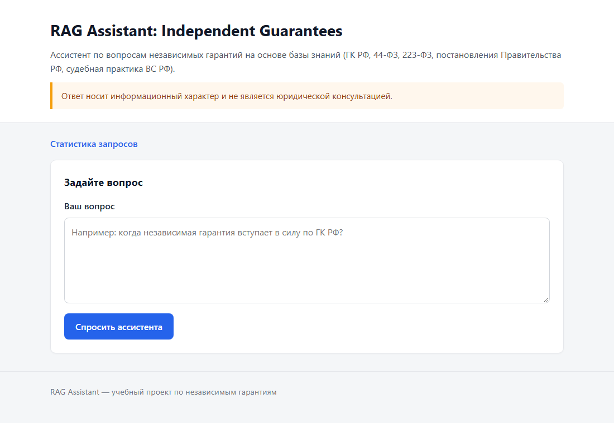
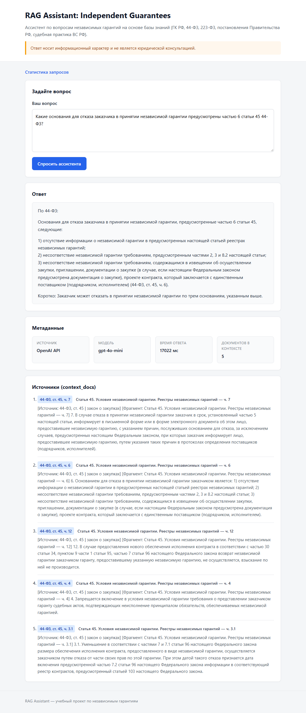
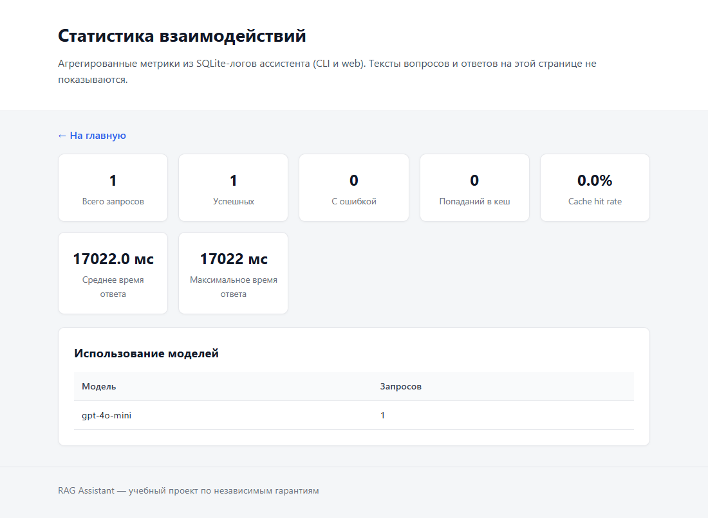

# RAG-ассистент по независимым гарантиям (законодательство РФ)

[](https://github.com/eliv1982/rag-assistant-independent-guarantees/actions/workflows/ci.yml)

Русскоязычный RAG-ассистент по независимым гарантиям по праву РФ: общие нормы Гражданского кодекса вместе со специальным закупочным регулированием (Федеральные законы № 44-ФЗ и № 223-ФЗ, постановления Правительства РФ № 1005 и № 1397) и разъяснениями Верховного Суда РФ. Ответ строится только по найденным фрагментам корпуса и сопровождается ссылками на статью, часть, пункт или позицию обзора.

*English summary: a Russian-language RAG assistant for independent guarantees under Russian law. It combines the Civil Code framework with procurement rules (Federal Laws No. 44-FZ and No. 223-FZ, Government Resolutions No. 1005 and No. 1397) and Supreme Court reviews. Structure-aware chunking, citations down to article/part/point/position, a no-evidence path, FastAPI web UI, Docker, CI.*

Это портфолио-проект. Ответы носят **информационный характер** и **не являются юридической консультацией**; сервис не претендует на полноту охвата и не готов к промышленной эксплуатации (см. «Ограничения»).

## Скриншоты

Снимки сделаны на текущей версии приложения, локально. Ответ на втором снимке получен одним реальным запросом к `gpt-4o-mini` и не доказывает юридическую корректность: ответы нужно сверять с первоисточниками.

**Главная страница**



**Ответ с узкими ссылками на источники.** Вопрос: «Какие основания для отказа заказчика в принятии независимой гарантии предусмотрены частью 6 статьи 45 44-ФЗ?». Под ответом показаны метаданные и пять найденных фрагментов со ссылками вида «44-ФЗ, ст. 45, ч. 6». Время ответа на снимке включает первичное построение индекса корпуса.



**Статистика: только агрегаты.** Страница `/stats` после этого запроса: счётчики, время ответа и использование моделей, без текстов вопросов, ответов и ошибок.



---

## Чем задача нетривиальна

- **Несколько уровней регулирования.** ГК РФ даёт общие нормы, 44-ФЗ и 223-ФЗ — специальные нормы закупок, постановления Правительства — требования, реестры и типовые формы, обзоры ВС РФ — толкование. Ответ не должен молча смешивать уровни.
- **Юридическая адресуемость.** Фрагмент должен быть привязан к статье, части, пункту, пункту типовой формы или номеру позиции обзора, иначе ссылку нельзя проверить. Нарезка по числу символов этого не даёт.
- **Утратившие силу нормы.** Статья 369 ГК РФ утратила силу с 1 июня 2015 года; корпус хранит её одной строкой-статусом, а промпт запрещает применять такие нормы как действующие.
- **Перечни и полнота.** На вопросы о «способах» и «основаниях» модель склонна достраивать перечень по памяти; промпт требует называть только элементы из фрагментов и не объявлять перечень исчерпывающим.
- **Вопрос вне корпуса.** Корпус намеренно узкий; ассистент должен отличать «в корпусе этого нет» от «в законодательстве этого нет».

---

## Правовой охват

Корпус — семь источников, исходные тексты без пересказа (`assistant_api/data/*.txt`):

| Источник | Что включено | Роль в поиске |
|----------|--------------|---------------|
| ГК РФ, § 6 | ст. 368–379 (ст. 369 — только статус) | общие нормы |
| 44-ФЗ | ст. 45 | специальные нормы закупок |
| 223-ФЗ | ст. 3.4, только положения о гарантиях (части 12, 14.1–14.3, 17, 31, 32) | специальные нормы закупок |
| Постановление Правительства РФ № 1005 (08.11.2013) | постановление и утверждённые им документы: требования, реестры, форма требования, типовые формы | требования и формы (44-ФЗ) |
| Постановление Правительства РФ № 1397 (09.08.2022) | постановление, Положение, приложения 1–4 (типовые формы и формы требований) | требования и формы (223-ФЗ, закупки с участием СМСП) |
| Обзор практики ВС РФ, утв. 05.06.2019 | все 17 правовых позиций | толкование и применение |
| Обзор практики ВС РФ, утв. 28.06.2017 | выборочно: вводная часть и позиции 25 и 30 | толкование и применение |

Подробная карточка каждого источника, правила обработки текста и оговорки о редакциях: [assistant_api/data/README.md](assistant_api/data/README.md). Состав и метаданные источников задаёт [assistant_api/corpus_config.py](assistant_api/corpus_config.py).

Ассистент не охватывает независимые гарантии «вообще»: другие статьи 44-ФЗ и 223-ФЗ, иные нормативные акты и международные правила в корпус не входят.

---

## Архитектура

```
вопрос ──► эмбеддинг вопроса ──► Chroma (cosine, top-N кандидатов)
                                        │
                      проверка достаточности данных (пустая выдача / опциональный порог)
                                        │
                      дедупликация ──► top-K фрагментов ──► промпт ──► чат-модель ──► ответ + источники
```

| Компонент | Назначение |
|-----------|------------|
| `assistant_api/web_app.py`, `templates/`, `static/` | FastAPI web UI: `/`, `/ask`, `/stats`, `/health` |
| `assistant_api/app.py` | CLI |
| `assistant_api/rag_pipeline.py` | RAG pipeline, промпт |
| `assistant_api/corpus_config.py` | состав корпуса, `corpus_id`, имя коллекции |
| `assistant_api/chunking.py`, `chunk_splitter.py` | нарезка по структуре источника |
| `assistant_api/vector_store.py` | ChromaDB и эмбеддинги |
| `assistant_api/evidence.py` | шлюз достаточности данных |
| `assistant_api/retrieval_utils.py` | дедупликация фрагментов |
| `assistant_api/cache.py`, `db_logger.py` | опциональный кеш ответов и журнал (SQLite) |
| `assistant_api/evaluate_ragas.py` | RAGAS (платные вызовы, вне CI) |
| `Dockerfile`, `docker-compose.yml`, `scripts/docker_smoke.sh`, `.github/workflows/ci.yml` | деплой и CI |

---

## Retrieval

- **Нарезка по структуре.** Пять стратегий (`civil_code`, `federal_law`, `government_resolution`, `court_review`, запасная `generic`) режут источник на юридически адресуемые блоки: статья → часть → пункт, пункты и разделы постановлений, пункты типовых форм, позиции обзоров. Крупные блоки делятся по подпунктам и предложениям; в каждом фрагменте повторяется заголовок статьи, раздела или позиции. При параметрах по умолчанию корпус даёт 356 фрагментов.
- **Метаданные и ссылки.** Фрагмент несёт узкую привязку (источник, статья, часть, пункт, позиция) и готовую ссылку вида «44-ФЗ, ст. 45, ч. 6»; на ней строятся цитаты в ответе и список источников в UI.
- **Поиск.** Плотный векторный поиск в ChromaDB по косинусному расстоянию. По умолчанию: эмбеддинги `text-embedding-3-small`, чат-модель `gpt-4o-mini`, `RAG_TOP_K=5`; из индекса берётся `max(3·K, K+5)` кандидатов.
- **Дедупликация.** Точные и почти точные дубли (сходство текста ≥ 0,92) убираются с сохранением порядка релевантности.
- **Чего нет:** reranking, гибридного (лексического) поиска и переформулировки вопроса.
- **`corpus_id`.** Отпечаток содержимого файлов корпуса, метаданных источников и параметров индексации. Он входит в имя коллекции Chroma и в ключ кеша: после изменения корпуса индекс строится заново, а старые ответы из кеша не отдаются.

---

## Опора на источники и отказ при нехватке данных

- Промпт требует отвечать только по переданным фрагментам, для существенных тезисов указывать источник в формате заголовка фрагмента, структурировать ответ по уровням регулирования («По ГК РФ», «По 44-ФЗ / 223-ФЗ», …), не придумывать номера статей и дел, не применять утратившие силу нормы и прямо называть, чего не хватает.
- **Пустая выдача** поиска всегда ведёт к ответу «в текущем корпусе недостаточно данных» без вызова чат-модели; этот ответ явно говорит, что корпус ограничен и это не означает отсутствия нормы в законодательстве.
- **Семантический порог `RAG_MAX_DISTANCE`** (максимальное косинусное расстояние лучшего фрагмента, число в (0, 2]) реализован, но **по умолчанию выключен** и не откалиброван: шкала расстояний зависит от модели эмбеддингов и корпуса, рекомендуемого значения в проекте нет. Пока он не задан, вопрос не по теме получит ближайшие фрагменты и дойдёт до модели; защита в этом случае — только промпт. Значение входит в ключ кеша; неверное значение — ошибка конфигурации, а не молчаливая подмена.
- Если генерация оборвана по длине или фильтром содержимого, к ответу добавляется предупреждение, и такой ответ не кешируется.
- **Офлайн-бенчмарк** ([tests/test_retrieval_benchmark.py](tests/test_retrieval_benchmark.py)) — детерминированный регрессионный тест структуры поиска: 20 вопросов по теме корпуса с ожидаемыми якорями (статья, часть, пункт формы, позиция) и 4 вопроса вне темы. Гоняется настоящая нарезка, Chroma и дедупликация, но эмбеддинги подменены лексической заглушкой, поэтому тест проверяет нарезку, метаданные и привязку, а **не качество настоящей модели эмбеддингов**. Зафиксированные на заглушке значения hit@1 = 0,65, hit@3 = hit@5 = 1,0 — нижние границы для регрессии, а не метрика качества сервиса.

---

## Приватность и web-поверхность

- **Журнал** (SQLite) по умолчанию хранит только метаданные: интерфейс, статус, время ответа, модель, `top_k`, число источников, признак попадания в кеш и очищенный от секретов текст ошибки. Тексты вопросов и ответов не сохраняются; `LOGS_STORE_TEXT=1` включает их явно.
- **Кеш ответов** хранит вопросы и ответы на диске, поэтому **выключен по умолчанию** (`RAG_CACHE_ENABLED=1` включает). Пока он выключен, файл кеша не создаётся и не открывается.
- **`/stats`** показывает только агрегаты (число запросов, успехи и ошибки, кеш, среднее и максимальное время ответа, модели). Тексты вопросов, ответов и ошибок не показываются ни при каких настройках; `STATS_SHOW_RECENT=1` добавляет таблицу последних запросов, но только с метаданными.
- Текст вопроса не пишется в stdout / `docker logs`; секреты (ключ OpenAI, `sk-…`, `Bearer …`, пароли в URL) вычищаются из журнала и серверного лога.
- **Вопросы пользователя уходят внешнему провайдеру** (OpenAI или совместимый эндпоинт из `OPENAI_BASE_URL`) для эмбеддингов и генерации; на это настройки приватности приложения не влияют.
- Ответ модели отображается как Markdown, пропущенный через санитайзер `nh3` (скрипты, обработчики событий, относительные ссылки и прочий HTML отбрасываются). Все ответы получают `X-Content-Type-Options`, `Referrer-Policy`, `X-Frame-Options` и строгий `Content-Security-Policy` без исключений.
- **Интерактивная документация FastAPI (`/docs`, `/redoc`, `/openapi.json`) отключена.** У приложения один HTML-интерфейс и форма, а Swagger UI и ReDoc подгружают скрипты с CDN и потребовали бы ослабить CSP; для портфолио они ничего не добавляют.
- Авторизации и rate limiting у приложения нет; HSTS оно не выставляет (HTTPS обеспечивает reverse proxy). Контейнер работает не от root, порт в compose опубликован только на `127.0.0.1`.

---

## Локальный запуск

Нужен Python 3.11+. Скопируйте `.env.example` в `.env` и укажите `OPENAI_API_KEY` (пути хранилища локально не задавайте).

```powershell
python -m venv venv
.\venv\Scripts\Activate.ps1
python -m pip install -r requirements.txt
uvicorn assistant_api.web_app:app --reload --host 127.0.0.1 --port 8000
```

Web UI: http://127.0.0.1:8000, статистика: `/stats`, health check: `/health`. При первом вопросе индекс корпуса строится через API эмбеддингов (платные вызовы) и дальше переиспользуется, пока не изменится `corpus_id`.

CLI: `cd assistant_api && python app.py` (команды: `stats`, `clear`, `exit`).

Основные настройки (полный список с пояснениями — в [.env.example](.env.example)): `OPENAI_API_KEY`, `OPENAI_BASE_URL`, `RAG_CHAT_MODEL`, `RAG_EMBEDDING_MODEL`, `RAG_TOP_K`, `RAG_MAX_DISTANCE`, `RAG_CHUNK_*`, `RAG_CACHE_ENABLED`, `LOGS_STORE_TEXT`, `STATS_SHOW_RECENT`.

---

## Docker

```bash
cp .env.example .env     # замените заглушку OPENAI_API_KEY на настоящий ключ
docker compose up -d --build
```

Web UI: http://127.0.0.1:8010. Пока в `OPENAI_API_KEY` пусто или осталась заглушка, `/health` и `/stats` работают, а `/ask` отвечает `503` без обращений к OpenAI.

- Журнал (`logs.db`), индекс Chroma и, если включён кеш, `api_rag_cache.db` лежат в именованном томе `rag_runtime` (`/app/runtime`) и переживают пересборку образа; корпус не переиндексируется заново.
- В образ не попадают `.env`, локальные `chroma_db/`, кеш и логи, тесты и зависимости RAGAS. Есть `HEALTHCHECK` по `/health`.
- Команды для тома:

```bash
docker compose cp rag-guarantees:/app/runtime/logs.db ./logs.db        # выгрузить журнал
docker compose exec rag-guarantees sh -c 'rm -rf /app/runtime/chroma_db /app/runtime/api_rag_cache.db'   # сбросить индекс и кеш
docker compose down -v                                                  # удалить ВСЕ данные
```

**Публикация в сеть.** Порт намеренно не открыт наружу: у приложения нет авторизации. Для публикации поставьте перед ним reverse proxy (Caddy, nginx, Traefik) с HTTPS и авторизацией и проксируйте на `127.0.0.1:8010`; для разового доступа подойдёт SSH-туннель: `ssh -L 8010:127.0.0.1:8010 user@server`.

<details>
<summary>Обновление деплоя, запущенного по прежней схеме (порт на всех интерфейсах, журнал в <code>./runtime</code>)</summary>

Раньше compose публиковал порт `8010` на всех интерфейсах, а журнал лежал в `./runtime`. Теперь порт доступен только с хоста, данные лежат в томе `rag_runtime`. Прежний журнал можно перенести после `docker compose up -d --build`:

```bash
docker compose cp ./runtime/logs.db rag-guarantees:/app/runtime/logs.db
docker compose exec -u root rag-guarantees chown app:app /app/runtime/logs.db
```

`chown` обязателен: `docker cp` создаёт файл от root, и непривилегированный пользователь не сможет в него писать. Индекс Chroma и кеш не переносятся: корпус изменился, индекс строится заново.
</details>

---

## Тесты и CI

```bash
python -m pip install -r requirements-dev.txt
python -m unittest discover -s tests -p "test_*.py" -v
ruff check . --select E4,E7,E9,F
python -m compileall -q assistant_api tests
python -c "import assistant_api.web_app; print('web_app import OK')"
```

Тесты не обращаются к OpenAI: pipeline, хранилище и клиент подменяются заглушками. Они покрывают нарезку, корпус и `corpus_id`, шлюз достаточности данных, кеш и его приватность, журнал, рендеринг Markdown и заголовки безопасности web-слоя, а также офлайн-бенчмарк поиска.

CI ([.github/workflows/ci.yml](.github/workflows/ci.yml)) на каждый push в `main` и pull request запускает: ruff (консервативный набор правил), компиляцию, тесты на Python 3.11 и 3.12, импорт web-приложения, проверку `docker-compose.yml` (порт только на localhost), сборку образа и smoke-тест контейнера (`scripts/docker_smoke.sh`: `/health`, `HEALTHCHECK`, отсутствие root, запись в `/app/runtime`, журнал и его сохранность после пересоздания контейнера; ключ OpenAI в контейнер не передаётся).

**RAGAS** (`requirements-eval.txt`, `assistant_api/evaluate_ragas.py`) — дополнительная оценка faithfulness и context precision / utilization на эталонах из `EVALUATION_GROUND_TRUTHS`. Она требует платных вызовов OpenAI, не входит в CI, и её результаты в репозитории не публикуются.

---

## Ограничения

- Не юридическая консультация и не замена проверки первоисточников; ассистент может ошибаться и неполно извлекать нормы из контекста.
- Корпус — узкий снимок из семи источников (44-ФЗ — только ст. 45, 223-ФЗ — только положения о гарантиях ст. 3.4, обзор 2017 года — выборочно). Остальное законодательство, судебные акты по конкретным делам и международные правила не охвачены.
- Корпус обновляется вручную и не синхронизируется с изменениями законодательства; редакция и источник каждого файла в репозитории не зафиксированы (см. ниже).
- Семантический порог отказа реализован, но выключен по умолчанию, пока его не откалибруют под развёрнутую модель эмбеддингов и корпус.
- Поиск — только плотные эмбеддинги без reranking; оффлайн-бенчмарк использует детерминированные лексические эмбеддинги и служит регрессионным тестом, а не оценкой качества на реальной модели.
- Для публичного деплоя нужны reverse proxy с HTTPS, авторизация и rate limiting; сам сервис их не обеспечивает, а `/stats` без авторизации виден всем, кто достучится до порта (только агрегаты).
- Вопросы пользователей передаются внешнему провайдеру LLM.

---

## Актуальность корпуса и его поддержка

Корпус — отобранный снимок текстов, а не канал обновлений: приложение не проверяет, действует ли норма, и не следит за изменениями законодательства. В файлах нет отметки о редакции; единственные датированные следы — остаточные пометки «в ред.» (самая поздняя, на которую ссылаются тексты, — Федеральный закон от 16.04.2022 № 109-ФЗ). Это не доказывает отсутствия более поздних изменений. Перед использованием ответа проверяйте действующую редакцию по официальным источникам.

Чтобы обновить корпус: заменить файл проверенным текстом из официального источника, обновить [карточку источников](assistant_api/data/README.md) и при необходимости `corpus_config.py`, прогнать тесты и перестроить индекс (он пересоберётся сам при первом вопросе; это платные вызовы эмбеддингов).

---

## Лицензия

Код проекта распространяется по лицензии [MIT](LICENSE). Тексты законов, постановлений и обзоров Верховного Суда в `assistant_api/data/` — отдельные исходные материалы: они не являются авторским кодом проекта и этой лицензией не перелицензируются. Условия их использования определяются применимым правом; см. [assistant_api/data/README.md](assistant_api/data/README.md).
